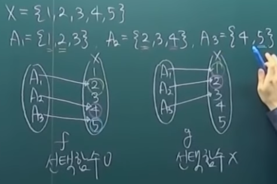
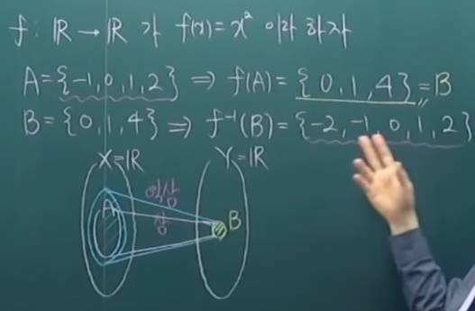

# 함수의 정의

함수란 다음 조건을 만족하는 관계 $f:X\to Y$ 를 말한다.

- $\forall x\in X,\ \exists y\in Y$ such that $(x,y)\in f$.
- If $(x,y_1)\in f$ and $(x,y_2)\in f$ then $y_1=y_2$.

즉, 각 $x\in X$에 대해 오직 하나의 $y\in Y$가 대응된다. 보통 $(x,y)\in f$를 $y=f(x)$로 쓴다.

함수의 구성요소
- $y=f(x)$일 때 $y$: $x$의 상(image)
- $x$: $y$의 원상(preimage)
- $X$: 정의역(domain), $\mathrm{Dom}(f)$
- $Y$: 공역(codomain)
- $\{f(x)\mid x\in X\}$: 치역(range), $\mathrm{Rng}(f)$

함수식이 같아도, domain이 다르면 다른함수임!  

제한과 확대  
$f:X\to Y$에서 $A\subset X$이면 제한함수(restriction)는
$$
f|_A=\{(x,y)\in f\mid x\in A\}.
$$
만약 $g=f|_A$이면 $f$는 $g$의 확대함수(extension)이다.

# 함수의 성질

함수 $f:X\to Y$에 대해

- 전사(surjective, onto): $\mathrm{Rng}(f)=Y$.
- 단사(injective, into): $x_1,x_2\in X,\ f(x_1)=f(x_2)\Rightarrow x_1=x_2$.
- 전단사(bijective): 전사이면서 단사인 함수(일대일 대응).
  - 전단사를 ~로 표기함; $f: X \sim \mathbb{N}$

# 여러 가지 함수

(1) 고등학교 교육과정 내 함수들

- 항등함수(identity function): $\forall x\in X,\ f(x)=x$인 함수. $I_X$로 표기하기도 함
- 상수함수(constant function): $\exists y_0\in Y$ s.t. $\forall x\in X,\ f(x)=y_0$.
- 역함수(inverse function): 전단사 $f:X\to Y$에 대해 $f^{-1}:Y\to X$가 존재하며 $f^{-1}(y)=x\iff f(x)=y$.
- 합성함수(composite): $f:X\to Y,\ g:Y\to Z$에 대해 $(g\circ f)(x)=g(f(x))$.
    - 합성함수의 성질들
        - $g\circ f \neq f\circ g$
        - 결합법칙(associativity): $h\circ(g\circ f)=(h\circ g)\circ f$ (정의역·공역이 맞는 경우).

        - 항등원: $I_X:X\to X$에 대해 $f\circ I_X=I_Y\circ f=f$.
        - $f^{-1}\circ f = I_X$
        - 합성과 합집합·교집합
            - $(g\circ f)\big(\bigcup_\alpha A_\alpha\big)=\bigcup_\alpha (g\circ f)(A_\alpha)$.
            - $(g\circ f)^{-1}\big(\bigcup_\alpha C_\alpha\big)=\bigcup_\alpha (g\circ f)^{-1}(C_\alpha)$, 그리고 교집합에 대해서도 전반적으로 전치가 성립함(원상은 교집합에 대해 포함 관계가 일반적으로 성립).

        - 단사·전사 관련 성질
            - 만약 $f,g$가 모두 단사이면 $g\circ f$도 단사.
            - $g\circ f$가 단사이면 반드시 $f$는 단사(하지만 $g$는 아닐 수도 있음).
            - 만약 $f,g$가 모두 전사이면 $g\circ f$도 전사.
            - $g\circ f$가 전사이면 반드시 $g$는 전사(하지만 $f$는 아닐 수도 있음).
            - 따라서 $g\circ f$가 전단사이면 $f$는 단사, $g$는 전사이다(양쪽이 전단사가 되려면 둘 다 전단사여야 함).

        - 역함수와의 관계
            - 만약 $f,g$가 전단사(즉 각각 역함수를 가짐)이면 $g\circ f$도 전단사이고
                $$
                (g\circ f)^{-1}=f^{-1}\circ g^{-1}.
                $$

        - 치환·취소 관점
            - 왼쪽 취소성: 어떤 $h$가 있어 $h\circ f=I$이면 $f$는 단사(왼쪽 역함수 존재).
            - 오른쪽 취소성: 어떤 $k$가 있어 $f\circ k=I$이면 $f$는 전사(오른쪽 역함수 존재).

(2) 고등학교 교육과정 외 함수들

- 포함함수(inclusion): $i_A:A\to X$, $\forall x\in A,\ i_A(x)=x$.
  - 항등함수의 축소된 함수. $I_x|A$
- 특성함수(characteristic function): $\chi_A:X\to\{0,1\}$로
$$
\chi_A(x)=\begin{cases}1,&x\in A\\0,&x\notin A\end{cases}.
$$
- 선택함수(selection function): $X\neq\varnothing$인 집합의 부분집합족 $\{A_i\}$에 대해 각 $A_i$에서 하나씩 원소를 선택하는 함수 $f:\{A_i\}\to X$ (즉 $f(A_i)\in A_i$).
 

# 주요 정리

- 함수 $f$에 대해 역함수 $f^{-1}$가 존재하면 $f$는 전단사이다.
1. 전사 증명
$$
\begin{aligned}
&f^{-1} \text{ 존재} 
&&\Rightarrow \forall y \in Y,\ \exists x \in X \text{ s.t. } (y,x) \in f^{-1} \\[4pt]
& &&\Rightarrow \forall y \in Y,\ \exists x \in X \text{ s.t. } (x,y) \in f \\[4pt]
& &&\Rightarrow \forall y \in Y,\ y \in \mathrm{Rng}(f) \\[4pt]
& &&\Rightarrow Y \subseteq \mathrm{Rng}(f) \\[4pt]
& &&\Rightarrow Y = \mathrm{Rng}(f) \quad (\because \mathrm{Rng}(f) \subseteq Y)
\end{aligned}
$$    
2. 단사 증명 
$$
\begin{aligned}
&f(x_1) = f(x_2) = y \\[4pt]
&\Rightarrow (x_1, y) \in f \ \land\ (x_2, y) \in f \\[4pt]
&\Rightarrow (y, x_1) \in f^{-1} \ \land\ (y, x_2) \in f^{-1} \\[4pt]
&\Rightarrow x_1 = x_2
\end{aligned}
$$

  - $g\circ f$가 단사이면 $f$는 단사이다.  
    증명  
    함수 $f : X \to Y$, $g : Y \to Z$라 하자.  
    임의의 $x_1, x_2 \in X$에 대하여 
    $$f(x_1) = f(x_2) \text{ 라 하자.}$$
    $$\Rightarrow g(f(x_1)) = g(f(x_2))$$
    $$\Rightarrow(g \circ f)(x_1) = (g \circ f)(x_2)$$
    그런데 $(g \circ f)$가 단사이므로 $x_1 = x_2$

  - $g\circ f$가 전사이면 $g$는 전사이다.  
    증명  
    $(g \circ f)$가 전사라고 하자.  
    $$ \forall z \in Z,\ \exists x \in X \text{ s.t. } (g \circ f)(x) = z$$
    $$\Rightarrow \forall z \in Z,\ \exists x \in X \text{ s.t. } g(f(x)) = z$$
    이때 $f(x) \in Y$이므로, 
    $$\forall z \in Z,\ \exists y = f(x) \in Y \text{ s.t. } g(y) = z$$
    따라서, $g \text{ 는 전사이다.} \quad \blacksquare$
    
- 정수집합 $\mathbb{Z}$와 자연수집합 $\mathbb{N}$ 사이에는 일대일 대응이 존재한다.
  증명  
  함수 $f : \mathbb{Z} \to \mathbb{N}$이 다음과 같이 정의되어 있다.
  $$ 
  f(x) =\begin{cases} 2x + 1, & x \ge 0 \\
  -2x, & x < 0
  \end{cases} 
  $$

  **$f$는 단사임을 증명**  
  임의의 $x_1, x_2 \in \mathbb{Z}$에 대하여 $f(x_1)=f(x_2)$라고 하자.  
  (Case 1) $x_1, x_2 \ge 0$일 때 
  $$
  f(x_1) = f(x_2)
  \Rightarrow 2x_1 + 1 = 2x_2 + 1
  \Rightarrow x_1 = x_2
  $$
  (Case 2) $x_1, x_2 < 0$일 때  
  $$
  f(x_1) = f(x_2)
  \Rightarrow -2x_1 = -2x_2
  \Rightarrow x_1 = x_2
  $$

  **$f$는 전사임을 증명**  
  양의 **홀수 집합**을 $\mathbb{N}_o$, 양의 **짝수 집합**을 $\mathbb{N}_e$라 하자. 즉, $\mathbb{N} = \mathbb{N}_o \cup \mathbb{N}_e$  
  (Case 1) 홀수에 대한 경우
  $$
  \forall 2n + 1 \in \mathbb{N}_o,\ \exists n \in \mathbb{Z}\ \text{s.t.}\ f(n) = 2n + 1
  $$
  (Case 2) 짝수에 대한 경우
  $$
  \forall 2m \in \mathbb{N}_e,\ \exists m \in \mathbb{Z}\ \text{s.t.}\ f(m) = -2m
  $$

# 집합의 함수 (Set Function)
(1) 정의  
함수 $f:X\to Y$에서 $A\subset X,\ B\subset Y$에 대해 다음이 성립한다.
- 상(image): $f(A)=\{f(x)\in Y\mid x\in A\}$.
- 역상 (preimage, inverse image, 원상이라고도 함): $f^{-1}(B)=\{x\in X\mid f(x)\in B\}$.
  
* A와 B의 역상은 같다는 보장은 일반적으론 없음.  

(2) 여러 가지 정리
함수 $f: X \to Y$에서 $A \subset X$이고 $B \subset Y$일 때 다음 네가지가 성립한다.
1. $f(\varnothing)=\varnothing$.
2. $\forall x\in X,\ f(\{x\})=\{f(x)\}$.
3. $f^{-1}(f(A))=A\iff f$는 단사.  
  - 증명  
    - (⇒) 방향 증명 : ($f^{-1}(f(A)) = A$ 이면 $f$가 단사 
    $$ f(\{x_1\}) = f(\{x_2\}) \\ 
    \Rightarrow\{f(x_1)\} = \{f(x_2)\} \\
    \Rightarrow f^{-1}(\{f(x_1)\}) = f^{-1}(\{f(x_2)\}) \\
    \Rightarrow\ \{x_1\} = \{x_2\} \\
    \Rightarrow\ x_1 = x_2
    $$
    - (⇐) 방향 증명 : $f$가 단사이면 $f^{-1}(f(A)) = A$  
    1. $f^{-1}(f(A)) \subseteq A$  
    $$
    \forall x \in f^{-1}(f(A)),\ f(x) \in f(A) \\
    \Rightarrow \exists x' \in A \text{ s.t. } f(x) = f(x') \\
    \Rightarrow x = x' \quad (\because f \text{ 단사}) \\
    \Rightarrow x \in A
    $$
    2. $f^{-1}(f(A)) \supseteq A$
    $$
    \forall x \in A,\ f(x) \in f(A) \\
    \Rightarrow x \in f^{-1}(f(A)) \text{ (역상은 범위가 더 넓어지므로)}
    $$
    - 따라서
    $$
    f^{-1}(f(A)) \subseteq A \ \text{and}\ A \subseteq f^{-1}(f(A))
    \Rightarrow f^{-1}(f(A)) = A \blacksquare
    $$

4. $f(f^{-1}(B))=B\iff f$는 전사.  
  증명 
  - (⇒) 방향: $f(f^{-1}(B)) = B \Rightarrow f$는 전사  
  $Y = f(f^{-1}(Y)) = Y$이므로 모든 $y \in Y$에 대해 $$\exists x \in X \text{ s.t. } f(x) = y$$
  즉 $f$는 전사
  - (⇐) 방향: $f$가 전사이면 $f(f^{-1}(B)) = B$
  1. $f(f^{-1}(B)) \subseteq B$
  $$
  \forall y \in f(f^{-1}(B)),\ 
  \exists x \in f^{-1}(B)\ \text{s.t. } f(x)=y \\
  \Rightarrow f(x)=y \text{ 이고 } f(x)\in B \\
  \Rightarrow y \in B \\
  \therefore f(f^{-1}(B)) \subseteq B
  $$
  2. $f(f^{-1}(B)) \supseteq B$
  $$
  \forall y \in B,\ \exists x \in f^{-1}(B)\ \text{s.t. } f(x)=y \\
  \Rightarrow f(x) \in f(f^{-1}(B)) \\
  \Rightarrow y \in f(f^{-1}(B)) \\
  \therefore f(f^{-1}(B)) \supseteq B
  $$

부분집합족에 대한 성질: $f:X\to Y$이고 $\{A_\alpha \mid \alpha\in I \}$를 $X$의 부분집합족이면 다음 세가지가 성립한다:

1. 
$$f\big(\bigcup_{\alpha\in I}A_\alpha\big)=\bigcup_{\alpha\in I}f(A_\alpha)$$
증명
$$
\begin{aligned}
y &\in f\Big(\bigcup_{\alpha\in I}A_\alpha\Big) \\[4pt]
&\Leftrightarrow \exists x \in \bigcup_{\alpha\in I}A_\alpha \text{ s.t. } y = f(x) \\[4pt]
&\Leftrightarrow \exists \alpha \in I,\ x \in A_\alpha \land y = f(x) \\[4pt]
&\Leftrightarrow \exists \alpha \in I,\ f(x) \in f(A_\alpha) \\[4pt]
&\Leftrightarrow \exists \alpha \in I,\ y \in f(A_\alpha) \\[4pt]
&\Leftrightarrow y \in \bigcup_{\alpha\in I} f(A_\alpha)
\end{aligned}
$$
2. 
$$f\big(\bigcap_{\alpha\in I}A_\alpha\big)\subseteq\bigcap_{\alpha\in I}f(A_\alpha)$$

증명
$$
\begin{aligned}
&\forall \alpha \in I,\ \bigcap_{\alpha\in I} A_\alpha \subseteq A_\alpha \\
&\therefore f\Big(\bigcap_{\alpha\in I} A_\alpha\Big) \subseteq f(A_\alpha) \text{ (함수의 단조성(monotonicity))}\\
&\therefore f\Big(\bigcap_{\alpha\in I} A_\alpha\Big) \subseteq \bigcap_{\alpha\in I} f(A_\alpha) \text{ (모든 alpha에 대해 위 포함이 참이므로)}
\end{aligned}
$$

3. 만약 $f$가 단사이면 등호가 성립한다:
$$
f\Big(\bigcap_{\alpha\in I}A_\alpha\Big)=\bigcap_{\alpha\in I}f(A_\alpha)
$$
증명  
$$
y \in \bigcap_{\alpha\in I} f(A_\alpha)
\Leftrightarrow
\forall \alpha \in I,\ y \in f(A_\alpha)
$$

$$
\Leftrightarrow
\forall \alpha \in I,\ \exists x_\alpha \in A_\alpha\ \text{s.t. } y = f(x_\alpha)
$$

단사성이므로
$$
f(x_\alpha) = f(x_\beta) \Rightarrow x_\alpha = x_\beta
$$

따라서
$$
x_\alpha = x_\beta = x_0 \quad (\forall \alpha,\beta \in I)
$$

즉,
$$
\exists x_0 \in \bigcap_{\alpha\in I} A_\alpha
\quad\text{이고}\quad
y = f(x_0)
$$

따라서
$$
y \in f\Big(\bigcap_{\alpha\in I}A_\alpha\Big)
$$
# 연습문제

1. $X=\{1,2,3,4\}$일 때, $X$에서 $X$로의
     - 항등함수의 개수
     - 상수함수의 개수
     - 전단사 함수의 개수
     를 구하시오.

2. $f:\mathbb{R}\to\mathbb{R}$이
$$
f(x)=\begin{cases}
x^2-5,& x\ge 1,\\[4pt]
3-2x,& x<1
\end{cases}
$$
일 때
     - $f(\{-5,2,4\})$
     - $f^{-1}(\{-1,3,7\})$
     를 구하시오.

3. $f:X\to Y$, $A\subseteq X$, $B\subseteq Y$일 때 다음 중 성립하지 않는 예를 제시하시오.
     - $B\neq\varnothing \Rightarrow f^{-1}(B)\neq\varnothing$
     - $f(X)=Y$
     - $f^{-1}(f(A))=A$
     - $f(f^{-1}(B))=B$
     - $f(A\cap B)=f(A)\cap f(B)$
     - $f(A)-f(B)=f(A-B)$

4. 양의 짝수 집합 $\mathbb{N_e}$와 자연수 집합 $\mathbb{N}$ 사이의 일대일 대응이 존재함을 증명하시오.
